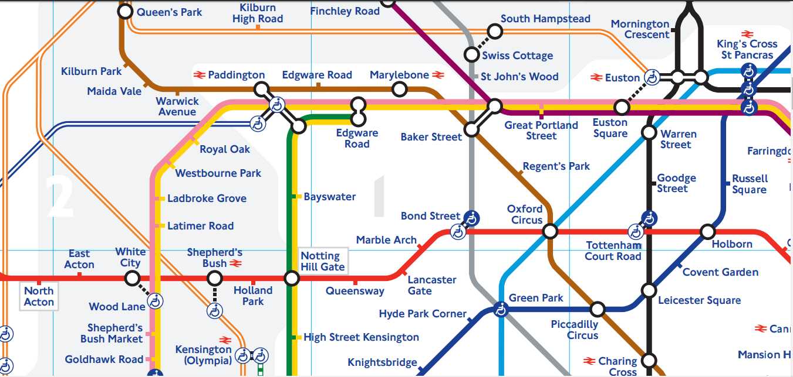
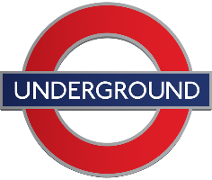

# PROLOG---London_Underground

**Executive Summary**

For this activity, a section of the London Underground was chosen which has 25 different stations connected to six different lines. The stations chosen can be seen on figure1. The aim was to have a Prolog implementation that can inform a potential user on how to get from a station to any other station on the network. It would also compute the shortest path between any two stations in terms of distance, the shortest path between any two stations in terms of time and the number of changes required between any two stations. Interstation database provided by Transport for London (TfL) and accessed through a freedom of information website [4] was used to calculate the times and distances between different stations.

By executing fours simple predicates in the Prolog implementation (given below), it is possible to find answers to the above queries.

**all \_paths** - for all possible paths

**min\_km** - for minimum path in terms of distance

**min\_time** - for minimum path in terms of time

**route** - for the number of changes required

The network however has some limitations. It assumes that the train travels at the same speed all the time without considering the layout of the track. Furthermore, it takes the un-impeded running time between station, ignoring the differences between peak and off-peak times. Additionally, it assumes the track length going forwards and backwards are the same (e.g. Eastbound vs Westbound).

In order to improve the implementation, it is recommended to add to the route query a response telling the user at which station one should change. Also, a response giving the number of stops between stations would also be useful, as most people are accustomed to that type of thinking when estimating the distance between underground stations. 

Furthermore, in order to deploy the work on the whole London underground network, a more complicated facts/rules must be implemented to represent some of the more complicated connections in certain section. Examples include the northern line or DLR branching out into different splits. This results in trains visiting different station while still sharing the same line. As a result, the user would have to be notified to take the train via certain routes (‘Morden via Charing Cross’ or ‘Morden via Bank’ in case of the northern line). Additional information that must be inputted into the fact table also involves the different types of connections between stations, for example Monument and Bank are connected by escalators.  

Lastly, further work a user might benefit from, also include finding the shortest path when a station or a whole line is closed, which happens quite often in the real world.

**Introduction/Background**

The study of logic has been found in ancient civilisations and has been scientifically investigated by philosophers of that time (i.e. Aristotle's Prior Analytics). However, it took late 19th century and early 20th century logicians such as George Boole and Gottlob Frege, to bring it to the forefront of mathematical science and help solve real-world problems with it [1]. As an example, Boolean algebra is today fundamental in the design of digital computer circuits [2].

Prolog is a logic programming language used in artificial intelligence that first appeared in 1972. It contrasts to other prominent programming languages, as in Prolog the programmer specifies *what* is to be done rather than *how* something is to be done. It forces the programmer to describe situations and problems, not the detailed means by which the problems are to be solved [3].

For this activity, a section of the London Underground was chosen which has 25 different stations connected to six different lines. The stations chosen can be seen on figure1. The aim was to have a Prolog implementation that can inform a potential user on how to get from a station to any other station on the network. It would also compute the shortest path between any two stations in terms of distance, the shortest path between any two stations in terms of time and the number of changes required between any two stations. Interstation database provided by Transport for London (TfL) and accessed through a freedom of information website [4] was used to calculate the times and distances between different stations.

In the Main content chapter, the full Prolog implementation is given with a brief description at each stage. In the chapter Prolog Queries, examples are given for queries addressing the aims of the activity, and the responses are also recorded to show how the program can be executed. Under Prolog documentation, some Prolog documentation used are also listed with a brief description.

Finally, in the chapter Conclusion the results and limitations are evaluated, improvements to the network are suggested and future possible work that would be beneficial are discussed.

Figure1. Section of the London Underground [5] 

## **Main content**

The full Prolog implementation is given below.

The connections between the stations are given by the fact *connect*. It outlines the two station that are connected, they’re respective distance, the time it takes to get from the first station to the second and the line that connects them.

**connect**(maida\_vale , warwick\_avenue , 0.79 ,  1.50 , bakerloo).

**connect**(warwick\_avenue , paddington , 0.88, 1.58,  bakerloo).

**connect**(paddington , royal\_oak , 0.64 , 1.33 , hammersmith).

**connect**(royal\_oak , westbourne\_park , 0.98 , 1.72 ,  hammersmith).

**connect**(westbourne\_park , ladbroke\_grove , 0.79 , 1.48 ,  hammersmith).

**connect**(ladbroke\_grove , latimer\_road , 0.66 , 1.28 ,  hammersmith).

**connect**(latimer\_road , white\_city , 1.01 , 1.70 ,  hammersmith).

**connect**(paddington , edgeware\_road , 0.82, 1.85 , circle).

**connect**(paddington , bayswater , 0.98 , 1.65 , circle).

**connect**(bayswater , notting\_hill\_gate , 0.79 , 1.47 , circle).

**connect**(notting\_hill\_gate , holland\_park , 0.61 , 1.18 , central).

**connect**(holland\_park , sheperds\_bush , 0.87 , 1.52 , central).

**connect**(sheperds\_bush , white\_city , 1.16 , 2.77 , central).

**connect**(notting\_hill\_gate , queensway , 0.69 , 1.18 , central).

**connect**(queensway , lancaster\_gate , 0.90 , 1.65 , central).

**connect**(lancaster\_gate , marble\_arch , 1.20 , 1.62 , central).

**connect**(marble\_arch , bond\_street , 0.55 , 1.02 , central).

**connect**(bond\_street , oxford\_circus , 0.66 , 1.03 , central).

**connect**(oxford\_circus , warren\_street , 0.90 , 1.72 , victoria).

**connect**(oxford\_circus , tottenham\_court\_road , 0.58 , 0.98 , central).

**connect**(tottenham\_court\_road , holborn , 0.88 , 1.63 , central).

**connect**(holborn , russell\_square , 0.72 , 1.55 , piccadily).

**connect**(russell\_square , kings\_cross , 0.91 , 1.90 , piccadily).

**connect**(kings\_cross , euston , 0.74 , 1.32 , victoria).

**connect**(euston , warren\_street , 0.76 , 1.30 , victoria).

The following piece of code states that If stop A is connected to stop C, then stop C is also connected to stop A with the same underground line L, length X and time V. It allows for the track to run in both forward and backward directions (e.g. Eastbound vs Westbound).

**next**(A,C,X,V,L):-**connect**(A,C,X,V,L).

**next**(A,C,X,V,L):-**connect**(C,A,X,V,L).

This path predicate finds the path between two station A (starting point) and B (end). The path we are on is given by the list [A | Left] with A as the head and Left as tail. By querying the ***next*** predicate (given above), which relays information on how stations are connected, the algorithm decides to go to station C and checks that C is not a station already visited (by the *\+member* clause) to avoid any cycles. Then the respective length X and time V are added to TempLength and TempTime in order to get the updated length and time (UpdateLength and UpdateTime). The algorithm then continues this cycle, at each stop updating the path’s respective length and time, until it reaches the last station B, given by the condition found in the first path predicate (first line).

**path**([B | Left], B, [B | Left], Length, Length,Time,Time).

**path**([A | Left], B, Path, TempLength, Length, TempTime,Time) :-

`               `next(A, C, X,V,\_),

`               `\+member(C, [A | Left]),

`               `UpdateLength is TempLength + X,

`               `UpdateTime is TempTime + V,

`               `path([C, A | Left],B,Path,UpdateLength,Length,UpdateTime,Time).

The following predicate gives all the possible paths between two station A and B and their respective lengths and time.

**all\_paths**(A, B) :-

`  `path([A], B, Path, 0, Length,0,Time),

`  `reverse(Path, StraightPath),

`  `print(StraightPath),

`  `write('with a length (in km) of '), print(Length),

`  `write(', and time (in mins) of '),  print(Time),nl,nl,

`  `fail.

Minimum path calculation is possible by comparing the different *'Lengths/times'*,

and picking the smallest one using a conditional operator.

**minCalc**([[Path, Length]], [Path, Length]).

**minCalc**([[Path,Length] | Left],[Path2,Length2]):-

`                                        `minCalc(Left,[Path1,Length1]),

`                                        `Length < Length1 ->

`                                        `Path2 = Path,

`                                        `Length2 = Length;

`                                        `Length >= Length1 ->

`                                        `Path2 = Path1,

`                                        `Length2 = Length1.

Predicate for the path with the shortest distance in km between two stations. Initial length and time set to zero. Bagof will gather the results made from pairs of [Path, Length] in List, and minCalc will compute the minimum out of all of them.

**min\_km**(A,End,Min):-

`   `bagof([Path,Length],path([A],End,Path,0,Length,0,\_),List), minCalc(List,Min).

Predicate for the path with the lowest time in minutes between two stations. Initial length and time set to zero. Bagof will gather the results made from pairs of [Path, Time] in List, and minCalc will compute the minimum out of all of them.

**min\_time**(A,End,Min):-

`    `bagof([Path,Time],path([A],End,Path,0,\_,0,Time),List),minCalc(List,Min).

It is also possible to calculate the number of necessary changes required when travelling from one station to another.

The following gives the case when the path between two station A and C lies on the same underground line L, where S is the temporary route covered while F is the final route.

**straightlink**(A,C,L,S,[C|S]):- next(A,C,\_,\_,L).

**straightlink**(A,C,L,S,F):-

`    `next(A,Z,\_,\_,L),\+(member(Z,S)),

`    `straightlink(Z,C,L,[Z|S],F).

Case where the path between two stations A and C requires one change, with Z being the interchange station and L and L2 being the two different lines.

**one\_change**(A,C,L,F):-

`        `straightlink(A,Z,L,[A],F1),

`        `straightlink(Z,C,L2,[Z|F1],F),L\=L2.

Case where the path between two stations A and C requires two changes, with Z and U being the interchange stations, and L, L1 and L2 being the three different lines.

**two\_change**(A,C,L,F):-

`        `straightlink(A,Z,L1,[A],F1),

`        `straightlink(Z,U,L2,[Z|F1],F2),L1\=L2,

`        `straightlink(U,C,L,[U|F2],F),L\=L1,L\=L2.

Case where the path between two stations A and C requires three changes, with Z, U and R being the interchange stations and L, L1, L2 and L3 being the four different lines.

**three\_change**(A,C,L,F):-

`        `straightlink(A,Z,L1,[A],F1),

`        `straightlink(Z,U,L2,[Z|F1],F2),L1\=L2,

`        `straightlink(U,R,L3,[U|F2],F3),L3\=L1,L3\=L2,

`        `straightlink(R,C,L,[R|F3],F),L\=L1,L\=L2,L\=L3.

Condition to check that a station exists in case of any errors.

**exist**(A):-next(A,\_,\_,\_,\_).

The following checks if route between two station requires no changes by querying **straightlink**, and if true returns the message *'No change required'*.

**route**(A,C,F):-exist(A),exist(C),

`       `straightlink(A,C,\_,[A],F),

`       `write('No change required'),nl,

`       `re\_write(F).

Checks if route between two station requires one change by querying **one\_change**, and if true returns the message *'One change required'*.

**route**(A,C,F):-exist(A),exist(C),

`              `one\_change(A,C,\_,F),

`              `write('One change required'),nl,

`              `re\_write(F).

Checks if route between two station requires two changes by querying **two\_change**, and if true returns the message *'Two changes required'*.

**route**(A,C,F):-exist(A),exist(C),

`       `two\_change(A,C,\_,F),

`       `write('Two changes required'),nl,

`       `re\_write(F).

Checks if route between two station requires three changes by querying **three\_change**, and if true returns the message *'Three changes required'*.

**route**(A,C,F):-exist(A),exist(C),

`       `three\_change(A,C,\_,F),

`       `write('Three changes required'),nl,

`       `re\_write(F).

Reverses the order (Tail first and then Head) and adds a separator for clarity.

**re\_write**([X1]):-write(X1).

**re\_write**([H1|T1]):-re\_write(T1), write('->'),write(H1).

**Prolog Queries**

If a user wants to travel from one station to another, and wants to check all the possible paths, he can do so by calling the ***all \_paths*** predicate and inputting the required stations. 

**For example, to go from *maida\_vale* to *warren\_street*, one can query:**

?- **all\_paths**(maida\_vale,warren\_street).

And the result is given below:

[maida\_vale,warwick\_avenue,paddington,royal\_oak,westbourne\_park,ladbroke\_grove,latimer\_road,white\_city,sheperds\_bush,holland\_park,notting\_hill\_gate,queensway,lancaster\_gate,marble\_arch,bond\_street,oxford\_circus,warren\_street]with a length (in km) of 13.290000000000001, and time (in mins) of 24.279999999999998

[maida\_vale,warwick\_avenue,paddington,royal\_oak,westbourne\_park,ladbroke\_grove,latimer\_road,white\_city,sheperds\_bush,holland\_park,notting\_hill\_gate,queensway,lancaster\_gate,marble\_arch,bond\_street,oxford\_circus,tottenham\_court\_road,holborn,russell\_square,kings\_cross,euston,warren\_street]with a length (in km) of 16.980000000000004, and time (in mins) of 31.24

[maida\_vale,warwick\_avenue,paddington,bayswater,notting\_hill\_gate,queensway,lancaster\_gate,marble\_arch,bond\_street,oxford\_circus,warren\_street]with a length (in km) of 8.34, and time (in mins) of 14.419999999999998

[maida\_vale,warwick\_avenue,paddington,bayswater,notting\_hill\_gate,queensway,lancaster\_gate,marble\_arch,bond\_street,oxford\_circus,tottenham\_court\_road,holborn,russell\_square,kings\_cross,euston,warren\_street]with a length (in km) of 12.030000000000001, and time (in mins) of 21.38

false.

From the result it is possible to see that there are four different paths from *maida\_vale* to *warren\_street*, each with different lengths and times.

**To pick the shortest path based on distance (km), one can call:**

?- **min\_km**(maida\_vale,warren\_street,Min).

Min = [[warren\_street, oxford\_circus, bond\_street, marble\_arch, lancaster\_gate, queensway, notting\_hill\_gate, bayswater|...], 8.34]

From the result one can see that it picked the path with the shortest distance (8.34).

**To pick the shortest path based on time (mins), one can call:**

?- **min\_time**(maida\_vale,warren\_street,Min).

Min = [[warren\_street, oxford\_circus, bond\_street, marble\_arch, lancaster\_gate, queensway, notting\_hill\_gate, bayswater|...], 14.419999999999998]

From the result one can see that it picked the path with the lowest time (14.4) out of all the four different paths.

**One can also query the number of changes required to get from one station to any other in the network by invoking the route predicate as follows:**

?- ***route***(white\_city,holborn,\_).

- No change required

white\_city->sheperds\_bush->holland\_park->notting\_hill\_gate->queensway->lancaster\_gate->marble\_arch->bond\_street->oxford\_circus->tottenham\_court\_road->holborn

**true**

The result shows that in order to get from white\_city to holborn, no changes are required. This is true as both stations lie on the central line. 

**The following is an example where one change is required to get from one station to any other in the network.**

?- **route**(bayswater,holborn,\_).

- One change required

bayswater->notting\_hill\_gate->notting\_hill\_gate->queensway->lancaster\_gate->marble\_arch->bond\_street->oxford\_circus->tottenham\_court\_road->holborn

**true**

To get from bayswater to holborn, one must change from the district line to the central line. As a result, the answer given is correct as that counts as one change.

**The following is an example where two changes are required to get from one station to any other in the network.**

?- **route**(paddington,russell\_square,\_).

- Two changes required

paddington->royal\_oak->westbourne\_park->ladbroke\_grove->latimer\_road->white\_city->white\_city->sheperds\_bush->holland\_park->notting\_hill\_gate->queensway->lancaster\_gate->marble\_arch->bond\_street->oxford\_circus->tottenham\_court\_road->holborn->holborn->russell\_square

**true** 

In order to get from Paddington to russell\_square, one must change from the circle line to the central line and then again to the piccadilly line. This amounts to two changes, therefore the route predicate has computed correctly.

**The last example gives the condition where three changes are required to get from one station to any other in the network.**

?- **route**(maida\_vale,warren\_street,\_).

- Three changes required

maida\_vale->warwick\_avenue->paddington->paddington->royal\_oak->westbourne\_park->ladbroke\_grove->latimer\_road->white\_city->white\_city->sheperds\_bush->holland\_park->notting\_hill\_gate->queensway->lancaster\_gate->marble\_arch->bond\_street->oxford\_circus->oxford\_circus->warren\_street

**true**

In order to get from maida\_vale to warren\_street, one must change from the bakerloo line to the circle line, then from the circle to the central line, and finally to the Victoria line. This amounts to three changes, therefore the route predicate has again computed correctly.

**Prolog documentation - built-in predicates**

**\+  -** True if *Goal* cannot be proven

**Bagof/3**(*+Template, :Goal, -Bag*) **-** Unify Bag with the alternatives of Template.	

**Print/1** - Printing *Term*

**Reverse/2** - Reverses a list

**write/1 -** Write a *Term* to the current output, using brackets and operators where appropriate.

**nl/0** - Write a newline character to the current output stream.

**->**  conditional operator

Number **is** +Expr - True when *Number* is the value to which *Expr* evaluates

**Conclusion**

The full Prolog implementation can find all the possible paths, the shortest path in terms of time, the shortest path in terms of distance and the minimum changes required between any two stations in the network. It is possible to do so by using only four simple predicates:

**all \_paths** -for all possible paths

**min\_km** -for minimum path in terms of distance

**min\_time** -for minimum path in terms of time

**route** -for the number of changes required

From observations, one can see that ***min\_km*** and ***min\_time*** always return the same path. This is a result of the direct relationship between distance and time, as distance increases so does time. Therefore, for this network one of them can become redundant as the path with the shortest distance will always have the lowest time. It is important to note however, this is not always the case in the London Underground. Though trains travel at an average speed of 30km/hr [5], they will speed up or slow down on certain section, depending on the layout of the track (sharp bends for example) and location (outside tunnels).

On top of that, the timing between two station will also depend on the on their locations. If situated in busy areas or their path passes through busy stations, it will take significantly longer. In addition, from the dataset obtained to calculate the distances and times, one can observe that there are three different times: Un-impeded running time, AM peak (7.00-10.00) and Interpeak (10.00-16.00). As a result, the time of travel will also have a considerable effect on the total time taken between two stations.

Another observation one can make from the dataset, is that the forward length between two stations varies from the backward length (Eastbound vs Westbound), but this is not represented in the fact rules for simplicity purposes. As a result, the direction of travel will also influence the time taken between two stations.

In order to improve the implementation, it is recommended to add to the route query a response telling the user at which station one should change, rather than just the number of changes required. Moreover, explicitly informing the user on the number of stops between two station is also useful, as most people are accustomed to that type of thinking when estimating the distance between underground stations.

Furthermore, in order to deploy the work on the whole London underground network, more complicated facts/rules must be implemented to represent some of the more complicated connections in certain section. Examples include the northern line or DLR branching out into different splits. This results in trains visiting different station while still sharing the same line. As a result, the user would have to be notified to take the train via certain routes (‘Morden via Charing Cross’ or ‘Morden via Bank’ in case of the northern line). Additional information that must be inputted into the fact table also involves the different types of connections between stations, for example Monument and Bank are connected by escalators. 

The Underground has a few special cases as mentioned above, and each unique case must be recorded and described in the program, before the application can deployed. 

Lastly, further work a user might benefit from, also include finding the shortest path when a station or a whole line is closed, which happens quite often in the real world.

**References**

**[1]** Muggleton, S., 2020. *Inductive Logic Programming*. [online] Doc.ic.ac.uk. Available at: <http://www.doc.ic.ac.uk/~shm/Papers/ilp.pdf> [Accessed 2 April 2020].

` `**[2]** Encyclopedia Britannica. 2020. *George Boole | British Mathematician*. [online] Available at: <https://www.britannica.com/biography/George-Boole> [Accessed 1 April 2020].

**[3]** Bratko, I., 2020. *PROLOG PROGRAMMING FOR ARTIFICIAL INTELLIGENCE*. [online] Silp.iiita.ac.in. Available at: <https://silp.iiita.ac.in/wp-content/uploads/PROLOG.pdf> [Accessed 1 April 2020].

` `**[4]** WhatDoTheyKnow. 2020. *Distance Between Adjacent Underground Stations - A Freedom Of Information Request To Transport For London*. [online] Available at: <https://www.whatdotheyknow.com/request/distance\_between\_adjacent\_underg> [Accessed 1 April 2020].

**[5]** Content.tfl.gov.uk. 2020. [online] Available at: <http://content.tfl.gov.uk/standard-tube-map.pdf> [Accessed 1 April 2020].

` `PAGE   \\* MERGEFORMAT 2

